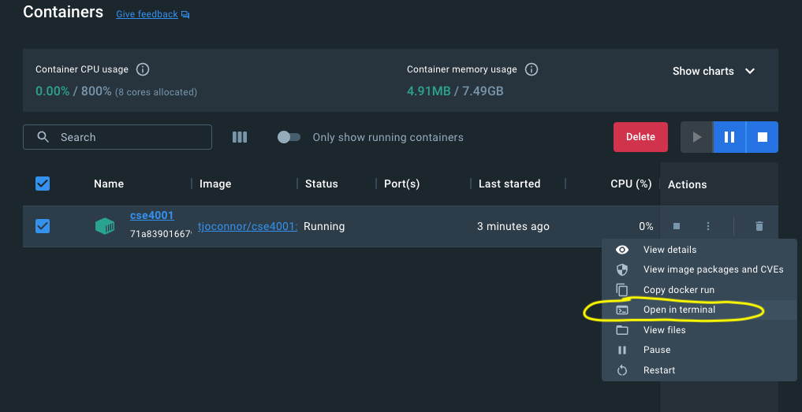
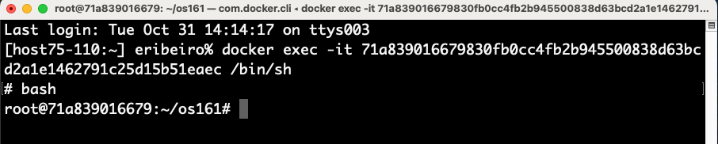
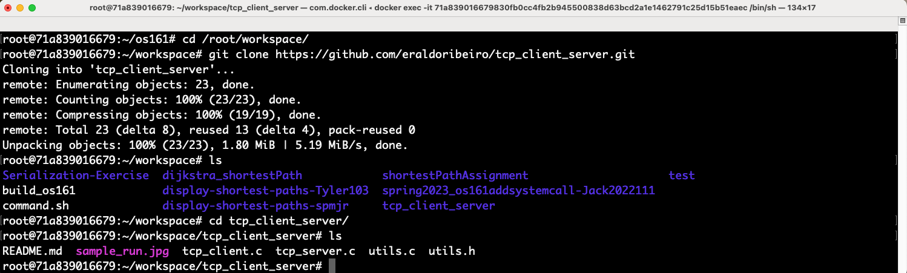

# Temperature stabilization using inter-process communication

### This is a Linux/Unix OS assignment. It is not an OS/161 Assignment

 This means that you will not write code for OS/161, you will write and test your code on a Linux or any Unix-based OS, e.g., any Linux server, AWS, Mac OS X (Terminal), and the Linux environment that comes with your CSE4001 container. 

If you use the CSE4001 container, I suggest that you clone the sample code (see link to sample code below) or write your own code in the container’s directory `/root/workspace/`. To run the server and client processes, open multiple terminal windows on the same container. To do that, you can: 

1. **Using the Docker app**. Run the CSE4001 container from the Docker app and open a terminal, i.e., use the option `Open in terminal` that is provided by the drown-down `Actions` menu. See figure below: 

    

   Once the terminal is open, choose `Open in external terminal` and then run the `bash` shell by typing bash on the command line. See figure below: 

    

   

2. **Open multiple terminals from the command line**. To open another terminal on the same active container, type the following command on another terminal. In this case, the terminal will already start running `bash` shell.

```shell
docker exec -it cse4001 bash
```

3. Go to the `/root/workspace/` directory and clone the sample code or create a directory where you will write your code for the assignment. 

   

### Description

In this assignment, you will implement a basic temperature-stabilization system using processes.The multiple processes in the system will communicate with one another using inter-process communication methods. Specifically, your solution to the temperature-stabilization problem will be implemented using **Internet stream (TCP) sockets** for process communication.

The temperature-stabilization system in this assignment consists of 5 processes. Four **external** processes that send their individual temperatures to a **central** process. The central process will then reply by sending its own calculation of the temperature to the external processes. Once the temperature of the entire system has stabilized, the central process will print a message indicating that the system has stabilized and processes will terminate. Each process will receive (or have) its initial temperature upon creation and will recalculate a new temperature according to two formulas:

**External processes:**

$$
\text{externalTemp} \longleftarrow \left(3 \cdot \text{externalTemp} + 2\cdot \text{centralTemp} \right) / 5
$$

**Central process:**

$$
\text{centralTemp} \longleftarrow \left(2 \cdot \text{centralTemp} + \sum_{i=1}^4 \text{externalTemp}_i \right) / 6
$$

Initially, each external process will send its temperature to the central process. If all four temperatures are the same (or sufficiently similar) as those sent by the four processes during the last iteration, the system has stabilized. In this case, the central process will notify each external process that it is now finished (along with the central process itself), and each process will output the final stabilized temperature. If the system has not yet become stable, the central process will send its new (updated) temperature to each of the external processes and await their replies. The processes will continue to run until the temperature has stabilized.

Each external process will be uniquely identified by a command-line parameter. The first parameter to each external process will be its unique number: 1, 2, 3, or 4. The second parameter will be its initial temperature. The central server will be passed one parameter, i.e., its initial temperature. 

### TCP sockets for process communication

)

### Implementation details

- Add some instructions on the `README.md` file on how to run your program.
- Don't worry about killing Zombies. Let them be.  
- The simplest way to start the implementation is to use the sample source code from the following link: https://github.com/eraldoribeiro/tcp_client_server, or any example in which two processes exchange some message packaged as a C structure (i.e., `struct`). Given an example with two processes communicating via TCP sockets, you just need to extend the example to implement the solution of the assignment. 

### What to submit

`Add/Commit/Push` the source code of your program into the GitHub repository for the assignment. Do not upload executable files or temporary files that result from the compilation process. 

Describe the execution of your program in the repository's `README.md` file. Here, include figures of relevant screenshots showing the execution of the entire system. For example, if you run each process in a separate terminal, you can capture all terminals working side-by-side into a single screenshot. Submissions without a `README.md` and screenshots showing the program's execution will suffer a 20-point deduction in the grade in the assignment grade. 

### Data serialization and book on network programming

This assignment is about using sockets and network communication with multiple processes. The assignment asks you to implement a basic client-server program of a temperature-stabilization system.

The starter code I provide and your solution to the assignment do not perform serialization (I am assuming you will just extend my starter code to complete the assignment). Serialization is not an issue for the starter code provided because processes are exchanging data within the same machine and OS. 

Sending data across the network is not usually done by sending structures or objects (e.g., `struct`, `class`). Instead, network communication is often done by serializing the data to be sent and then de-serializing the data once it is received. When transmitting data through the network, the need for serialization arises because of the different ways different computer architectures represent numerical values such as doubles and floats in terms of their bit representation and byte ordering. 

If you want to learn more about Network Programming and a bit more on the serialization issue, I recommend the following book:

- **Beej's Guide to Network Programming: Using Internet Sockets** by Brian "Beej Jorgensen" Hall. 

The book is available online free of charge (https://beej.us/guide/bgnet/) and also sold by Amazon.com (https://www.amazon.com/dp/1705309909) if you want a paperback version. 

The book is written is a very conversational style that is both enjoyable and accessible. I think you will enjoy reading it. Give it a try if you have time. If you want just to learn about serialization in network communication then read the Section **7.5 Serialization—How to Pack Data** (https://beej.us/guide/bgnet/html/split-wide/slightly-advanced-techniques.html#serialization). 

 
