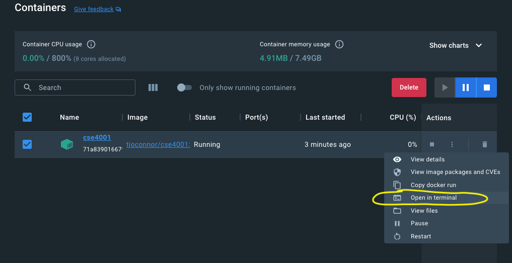
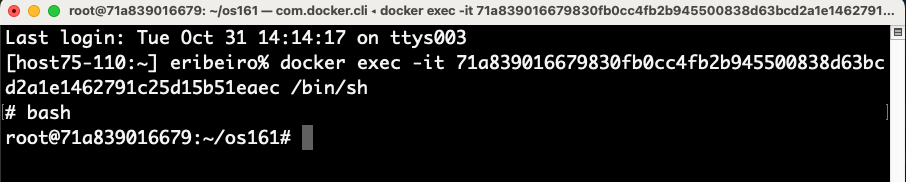
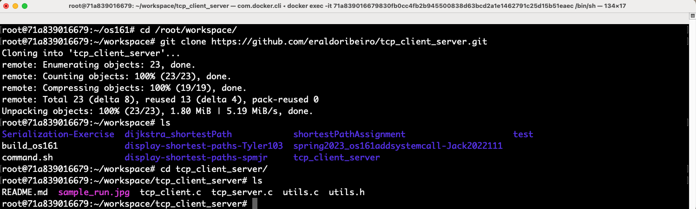

# CSE4001 - Assignment 5: 🌐 Temperature stabilization using inter-process communication 📡

>  **Assignment number**: 5
>
> **Assignment name**: `temperature-diffusion-sockets`

---

## :warning: This is a Linux/Unix OS assignment. It is not an OS/161 Assignment

This assignment does not use `OS/161`. This means that you will not write code for OS/161. Instead, you will write and test your code on a Linux or any Unix-based OS, e.g., the Linux environment that comes with your CSE4001 container or any Linux machine, AWS, Mac OS X (Terminal). 

---

## 🚨 Do this first!!🚨 Create your own private repository for the assignment

1. **Follow these instructions**: https://github.com/cse4001/cse4001_course_materials/blob/main/adm/submitting_assignments.md
2. **Learn how to clone repositories using the GitHub tool `gh`**: https://github.com/eribeiroClassroom/notes_github/blob/main/README.md 

- **Automated testing.** There is no automated test implemented for this assignment. 

## 🚀 Now, start the actual assignment

At this point, you should have already created your own private repository which contains the assignment files (i.e., kernel source code, test scripts, and test workflow directory). 

If you followed the instructions in https://github.com/cse4001/cse4001_course_materials/blob/main/adm/submitting_assignments.md, then all the required files should be in your private directory. 

### **Clone your private repository for this assignment**

#### Start the CSE4001 container, and clone the assignment repo

 Start the `CSE4001` container: 

  ```bash
docker start -i cse4001
  ```

  If the container fails to start, make sure the container is running by calling the `docker run` command. For details see notes: https://github.com/eraldoribeiro/UsingCSE4001_OS161/blob/main/RunningOS161_DockerDesktop.md

Clone the assignment repository. Do this from inside `/root/workspace/` in the `CSE4001` container. Use `git clone` or `gh repo clone`. 
    

```bash
cd /root/workspace
gh repo clone <assignment_repository_url>
```


### Steps to complete the assignment

1. **Clone** the assignment repository to your CSE4001 container's workspace directory (e.g., `/root/workspace/`) or any other machine running Linux. This is your private repository that you already created for the assignment.  
2. **Understand the specs**: read this assignment carefully and review the sample TCP code to identify missing pieces you must add (multi-process flow, message fields, stabilization check).
3. **Build a minimal prototype**: implement a two-process version (one client + the central server) that exchanges a temperature message round-trip. Once you solve the simpler pairwise client-server problem, it can be easily extended to multiple clients. 
4. **Scale to all processes**: extend to five processes total (server + four clients), keep persistent TCP connections, and implement the update rules for central/external temps each iteration.
5. **Add convergence logic**: define a tolerance (e.g., `EPS=1e-3`) and stop when all external temps change less than `EPS` between iterations; broadcast a “done” signal.
6. **Test thoroughly**: run in five terminals with several initial temperatures (some different) to verify multiple iterations occur before convergence.
7. **Document & illustrate**: capture screenshots showing all five terminals during execution and at stabilization; place images in the repo and **link them in `README.md`** (verify GitHub renders them correctly).
8. **Commit & push**: include source code only (no binaries or build artifacts). Make sure `README.md` contains build/run instructions (commands, args, ports).
9. **Submit**: paste your repository URL into the Canvas submission box.

### :fire: A common question about the example code in the previous link is: 

- 🤔 **Question**: The example code seems to solve the assignment. What is left to be done?
- :high_brightness: **The answer**: Please, read the assignment description and the code to identify the missing parts that need to be completed ([Here is a list of minimal changes](./minimum_changes.md)). 

### If you use the CSE4001 container

To run the server and client processes, open multiple terminal windows on the same container. 

1. **Using the Docker app**. Run the CSE4001 container from the Docker app and open a terminal, i.e., use the option `Open in terminal` that is provided by the drown-down `Actions` menu. See figure below: 

    

   Once the terminal is open, choose `Open in external terminal` and then run the `bash` shell by typing bash on the command line. See figure below: 

    

2. **Open multiple terminals from the command line**. To open another terminal on the same active container, type the following command on another terminal. In this case, the terminal will already start running `bash` shell.

```shell
docker exec -it cse4001 bash
```

3. Go to the `/root/workspace/` directory and clone the sample code or create a directory where you will write your code for the assignment. You might have already cloned the repository. 

   

### Description

In this assignment, you will implement a basic temperature-stabilization system using processes. The multiple processes in the system will communicate with one another using inter-process communication methods. Specifically, your solution will be implemented using **Internet stream (TCP) sockets** for process communication.

The temperature-stabilization system in this assignment consists of 5 processes. Four **external** processes that send their individual temperatures to a **central** process. The central process will then reply by sending its own calculation of the temperature to the external processes. Once the temperature of the entire system has stabilized, the central process will print a message indicating that the system has stabilized and processes will terminate. Each process will receive (or have) its initial temperature upon creation and will recalculate a new temperature according to two formulas:

**External processes:**

$$
\text{externalTemp} \longleftarrow \left(3 \cdot \text{externalTemp} + 2\cdot \text{centralTemp} \right) / 5
$$

**Central process:**

$$
\text{centralTemp} \longleftarrow \left(2 \cdot \text{centralTemp} + \sum_{i=1}^4 \text{externalTemp}_i \right) / 6
$$

Initially, each external process will send its temperature to the central process. If all four temperatures are the same (or sufficiently similar) as those sent by the four processes during the last iteration, the system has stabilized. In this case, the central process will notify each external process that it is now finished (along with the central process itself), and each process will output the final stabilized temperature. If the system has not yet become stable, the central process will send its new (updated) temperature to each of the external processes and await their replies. The processes will continue to run until the temperature has stabilized.

Each external process will be uniquely identified by a command-line parameter. The first parameter to each external process will be its unique number: 1, 2, 3, or 4. The second parameter will be its initial temperature. The central server will be passed one parameter, i.e., its initial temperature. 

### Overview diagram showing TCP sockets for process communication


### Implementation details

- Add some instructions on the `README.md` file on how to run your program.
- Don't worry about killing Zombies. Let them be. You do not need to implement a multi-connection server. As a result, zoombies are unlikely to be an issue. 
- The simplest way to start the implementation is to use the sample source code that comes with this repository. Alternatively, you can use any example you find that shows two processes exchanging some message packaged as a C structure (i.e., `struct`). Given an example with two processes communicating via TCP sockets, you just need to extend the example to implement the solution of the assignment. 

### What to submit

- `Add/Commit/Push` the source code of your program into the GitHub repository for the assignment. Do not upload executable files or temporary files that result from the compilation process. 

- Describe the execution of your program in the repository's `README.md` file. Here, include figures of relevant screenshots showing the execution of the entire system. For example, if you run each process in a separate terminal, you can capture all terminals working side-by-side into a single screenshot.

  :warning: Submissions without a `README.md` and screenshots showing the program's execution will suffer a **20-point deduction** in  in the assignment grade. 

- Paste the URL of your repository in the Canvas input box for this assignment. 

### Data serialization and book on network programming

This assignment is about using sockets and network communication with multiple processes. The assignment asks you to implement a basic client-server program of a temperature-stabilization system.

The starter code I provide and your solution to the assignment do not perform serialization (I am assuming you will just extend my starter code to complete the assignment). Serialization is not an issue for the starter code provided because processes are exchanging data within the same machine and OS. 

Sending data across the network is not usually done by sending structures or objects (e.g., `struct`, `class`). Instead, network communication is often done by serializing the data to be sent and then de-serializing the data once it is received. When transmitting data through the network, the need for serialization arises because of the different ways different computer architectures represent numerical values such as doubles and floats in terms of their bit representation and byte ordering. 

If you want to learn more about Network Programming and a bit more on the serialization issue, I recommend the following book:

- **Beej's Guide to Network Programming: Using Internet Sockets** by Brian "Beej Jorgensen" Hall. 

The book is available online free of charge (https://beej.us/guide/bgnet/) and also sold by Amazon.com (https://www.amazon.com/dp/1705309909) if you want a paperback version. 

The book is written is a very conversational style that is both enjoyable and accessible. I think you will enjoy reading it. Give it a try if you have time. If you want just to learn about serialization in network communication then read the Section **7.5 Serialization—How to Pack Data** (https://beej.us/guide/bgnet/html/split-wide/slightly-advanced-techniques.html#serialization). 


# tcp_client_server (Example)
Starter code example for tcp (socket) client-server system

#### Compilation instructions

```shell
gcc utils.c tcp_server.c -o server
gcc -o client tcp_client.c utils.c
```

#### Here is a typical command line, run each in its own terminal

Open a terminal and run: 

```shell
./server
```

Open four terminals and in each one run: 

```shell
./client <external index> <initial temperature>
```

##### Example:      

```shell
./client 1 100
```

```shell
./client 2 200
```

```shell
./client 3 300
```

```shell
./client 4 400
```


 
